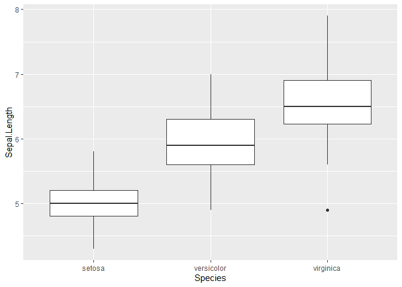

# Report


## Iris

Iris table

``` r
library(tidyverse)
count(iris, Species)
```

         Species  n
    1     setosa 50
    2 versicolor 50
    3  virginica 50

table

``` r
library(knitr)
kable(count(iris, Species))
```

| Species    |   n |
|:-----------|----:|
| setosa     |  50 |
| versicolor |  50 |
| virginica  |  50 |

``` r
library(flextable)
qflextable(count(iris, Species))
```


ggplot

``` r
ggplot(iris, aes(Species, Sepal.Length)) +
  geom_boxplot()
```


